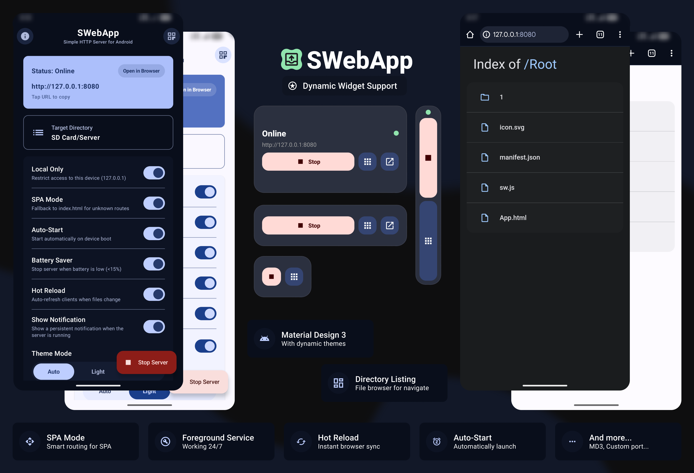

<kbd></kbd> <kbd>🪶 Easy to use</kbd> <kbd>🟣 Kotlin / Material UI 3 🟢</kbd> <kbd>📂 Open-Source</kbd> <kbd></kbd>  

<h1 align="center">&nbsp;&nbsp;&nbsp;&nbsp;&nbsp;&nbsp; $\Huge{\textsf{SWebApp}}$ <kbd>v.1.0</kbd> 
 </h1>

**SWebApp** is a lightweight, high-performance HTTP server for Android, specifically built for hosting **Single Page Applications (SPA)** and static websites directly from your phone.

> [!WARNING]
> This app started as a personal (pet) project and is not yet 100% production-ready. 

## ✨ Features

### 🌐 Server

- **SPA Ready:** Built-in fallback to `index.html` for modern frameworks (React, Vue, Angular).
- **Hot Reload:** Instant browser refresh when you modify your local site files.
- **Pretty URLs:** Access `about.html` simply as `*/about`.
- **Dynamic Directory Listing:** Beautifully rendered file explorer when no `index.html` is found.
- **Large File Streaming:** OOM-safe streaming for files larger than 8MB.

### 📱 Android

- **Material You (MD3):** Fully supports dynamic colors and adaptive themes (Light/Dark/Auto).
- **Foreground Service:** Stays alive in the background without being killed by the Android.
- **System Widget:** Toggle your server status directly from your home screen.
- **Auto-Start:** Automatically resume hosting on device boot.
- **Battery Saver:** Smart auto-stop when battery levels drop below 15%.

### 🛡️ Security & Flexibility

- **Localhost-Only Mode:** Restrict access to your device for private testing.
- **Security Hardening:** Advanced Path Traversal protection and secure headers (CSP, HSTS).
- **Custom Ports:** Configure any port between 1024 and 65535.
- **Integrated Logs:** Real-time visibility into incoming server requests.

## 🛠️ Tech. Stack

- **Language:** 100% Kotlin
- **UI Framework:** Jetpack Compose + Material Design 3
- **Server Engine:** Ktor
- **Connectivity:** Coroutines, Kotlin Flows

## 🚀 How to Use

1.  **Select Directory:** Pick the folder on your internal storage or SD card where your site is located.
2.  **Configure:** Set your desired port and toggle **SPA Mode** if you're hosting a web app.
3.  **Start:** Press the start button to launch the server.
4.  **Access:** Tap the generated URL to open the site in your mobile browser or share the IP with others on your WiFi (if you're not using localhost mode).

---

 <kbd>pls ⭐ project!</kbd> 

 <kbd>With</kbd> <kbd>❤️</kbd> <kbd>by</kbd> <kbd>Agzes</kbd> 

